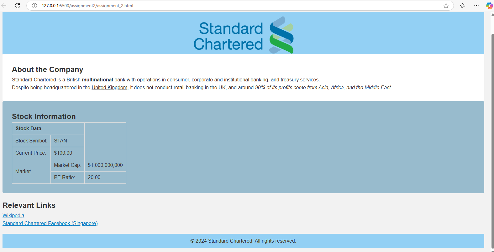
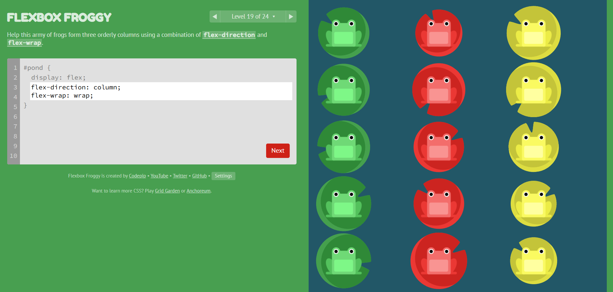
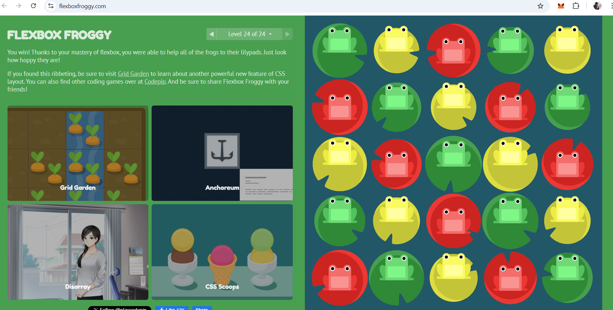
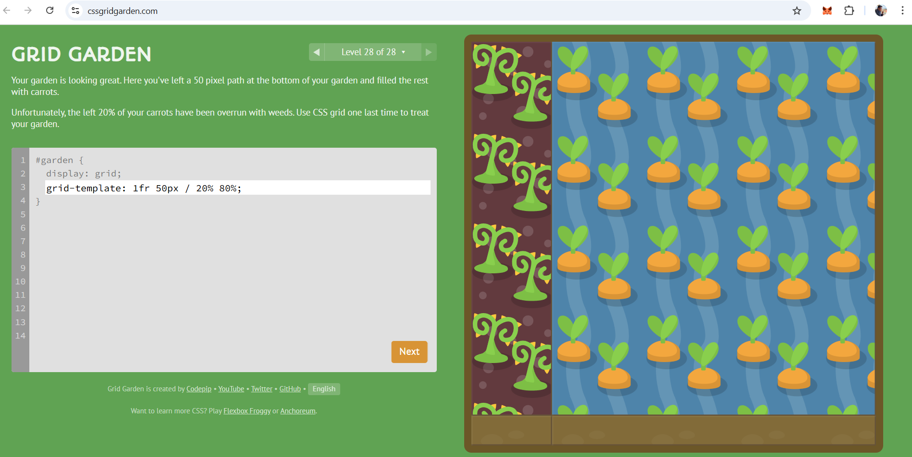
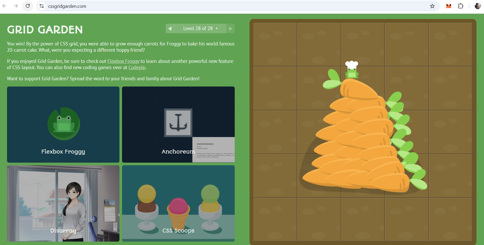

# NgChinLing
 SE100 repository

 ### Assignment 1 - Stock Profile page (HTML)

 

 ### Assignment 2 - Cascading Style Sheets (CSS)

 

#### Flexbox Groggy

 

 

 #### CSS Grid Garden
 

 

### Assignment 3 - Javascipt variables, arrays, decision structures
Arrays and Objects

### Assignment 4 - JavaScript Loops and Functions
Creating loops and functions (including arrow functions)

### Assignment 5 - Asynchronous Programming and Web APIs
Writing Promises

### Assignment 6 - React
Props, conditional rendering

